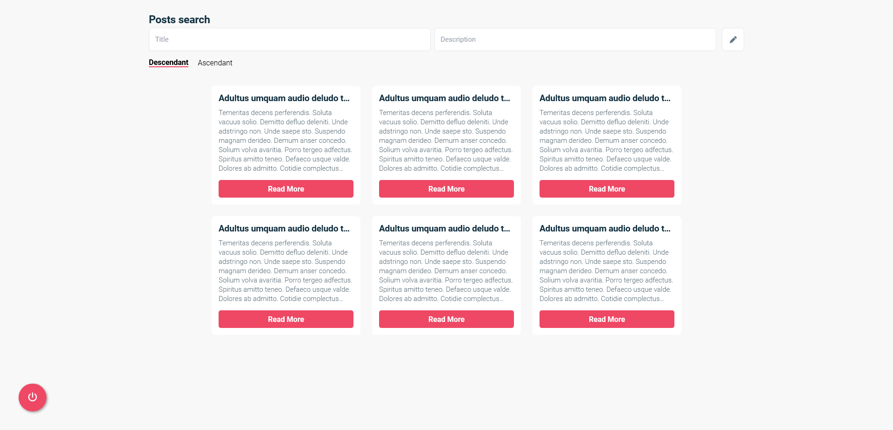

<p align="center">
   
</p>

# User Posts Design

[](https://github.com/JuanGabriel2960)
[](#)

<p>
  <a href="#closed_book-about-the-project">About the project</a>&nbsp;&nbsp;&nbsp;|&nbsp;&nbsp;&nbsp;
  <a href="#construction_worker-installation">Installation</a>&nbsp;&nbsp;&nbsp;|&nbsp;&nbsp;&nbsp;
  <a href="#rocket-getting-started">Getting Started</a>&nbsp;&nbsp;&nbsp;|&nbsp;&nbsp;&nbsp;
  <a href="#hammer-built-with">Built with</a>&nbsp;&nbsp;&nbsp;
</p>

<br>
<p align="center">
  </p>
<p align="center">
  
</p>
<br>

# :closed_book: About the project

Web application with authentication that allows a series of users to manage posts, the app allows you to obtain, create, filter, search and delete your own posts.

# :construction_worker: Installation

**You need to install [Node.js](https://nodejs.org/en/download/) first, then in order to clone the project via HTTPS, run this command:**

```git clone https://github.com/JuanGabriel2960/user-posts-design.git```

Or via SSH:

```git clone git@github.com:JuanGabriel2960/user-posts-design.git```

**Install dependencies**

```npm install```

# :rocket: Getting Started

### Prerequisites

- First, you will need to create an `.env`
- Then set the missing environment variables.
- To create the `.env` file just run `cp .env.example .env`.

### `npm start`

Runs the app in the development mode.\
Open [http://localhost:3000](http://localhost:3000) to view it in the browser.

The page will reload if you make edits.\
You will also see any lint errors in the console.

### `npm run build`

Builds the app for production to the `build` folder.\
It correctly bundles React in production mode and optimizes the build for the best performance.

The build is minified and the filenames include the hashes.\
Your app is ready to be deployed!

See the section about [deployment](https://facebook.github.io/create-react-app/docs/deployment) for more information.

# :globe_with_meridians: API

### **Auth Endpoint**

The auth endpoint handles the user login and register.

- **URL**

  ```
  /public/v2/users
  ```

  | Gist:                                       | Route:    | Method: | Success Status: | Type:   |
  | ------------------------------------------- | --------- | ------- | --------------- | ------- |
  | Returns the user associated with this email | `?email=` | `GET`   | 200             | PRIVATE |
  | Returns the new created user                | `/`       | `POST`  | 201             | PRIVATE |

### **Nested Posts Endpoint**

The nested posts endpoint handles all the request related to fetching and creating.

- **URL**

  ```
  /public/v2/users/:userId/posts
  ```

  | Gist:                                       | Route:     | Method: | Success Status: | Type:   |
  | ------------------------------------------- | ---------  | ------- | --------------- | ------- |
  | Returns all posts associated with a user    | `/`        | `GET`   | 200             | PRIVATE |
  | Create a new post and return it             | `/`        | `POST`  | 201             | PRIVATE |

### **Posts Endpoint**

The posts endpoint handles all the request related to deleting and getting a specific post.

- **URL**

  ```
  /public/v2/posts
  ```

  | Gist:                                    | Route:     | Method: | Success Status: | Type:   |
  | -----------------------------------------| ---------  | ------- | --------------- | ------- |
  | Returns the post associated with this id | `/:postId` | `GET`   | 200             | PRIVATE |
  | Deletes a post by id                     | `/:postId` | `POST`  | 204             | PRIVATE |

# :hammer: Built With

- [React](https://reactjs.org)
- [NodeJS](https://nodejs.org/en/)
- [TypeScript](https://www.typescriptlang.org/)
- [Tailwind](https://tailwindcss.com/)